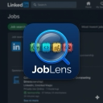

# JobLens — LinkedIn Job Analyzer

A Chrome extension that overlays four signal chips on every LinkedIn job posting so you can evaluate a role at a glance — without reading the full description.

---

## Chips

| Chip | What it shows |
|------|--------------|
| **Sponsorship** | Teal = likely sponsors. Red = explicit denial detected. |
| **Software Role** | Green = software eng. Red = non-software (hardware/mfg). Yellow = unclear. |
| **Experience** | Years required extracted from the JD (e.g. `3–5 yrs`, `2+ yrs`). |
| **Applicants** | Color-coded count — green (<100) → yellow → red → dark red (1000+). |

Hovering a chip shows a tooltip with matched keywords and confidence details.

---

## Features

- **H-1B / Visa sponsorship detection** — 60+ positive and negative patterns covering explicit denials (`"does not provide visa sponsorship"`), exclusion lists (`"No H1B, OPT, CPT"`), security clearance requirements (ITAR, DoD), and positive signals (`"immigration assistance"`, `"willing to sponsor"`).
- **Software role classifier** — weighted keyword scoring across job title, responsibilities, requirements, and about sections.
- **Experience extraction** — regex engine covering ranges (`3–5 yrs`), plus (`2+ yrs`), written numbers (`"four years"`), parentheticals (`"(4) years"`), hyphenated forms (`"hands-on"`), and 10+ other patterns.
- **Applicant count** — supports both old and new LinkedIn layouts, including premium insight panels.
- **In-page highlighting** — matched sponsorship and experience phrases are highlighted directly in the job description (dark-mode compatible).
- **SPA-aware** — uses MutationObserver + URL-based job key caching to update chips on navigation without flickering.
- **Works on all LinkedIn job URLs** — search results side panel, direct `/jobs/view/` links, and new `data-sdui-screen` layout.

---

## Install (Developer Mode)

1. Clone or download this repo.
2. Open Chrome → `chrome://extensions`
3. Enable **Developer mode** (top-right toggle).
4. Click **Load unpacked** → select this folder.
5. Open any LinkedIn job posting — chips appear below the job title.

To update after pulling changes: click the refresh icon on the extension card in `chrome://extensions`.

---

## File Overview

| File | Purpose |
|------|---------|
| `manifest.json` | Extension manifest (MV3) |
| `classifier.js` | Keyword classifier · experience extractor · sponsorship analyzer |
| `highlighter.js` | DOM text highlighter for sponsorship and experience phrases |
| `content-script.js` | DOM orchestration — finds title, injects chip row, drives all modules |
| `styles.css` | Chip and highlight styles |

---

## Tech

- Manifest V3, content scripts only
- No external APIs — fully client-side
- Tested on Chrome; should work on any Chromium-based browser
